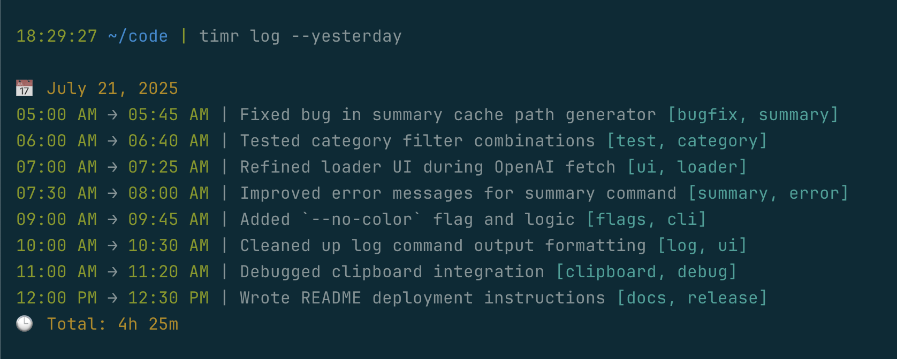
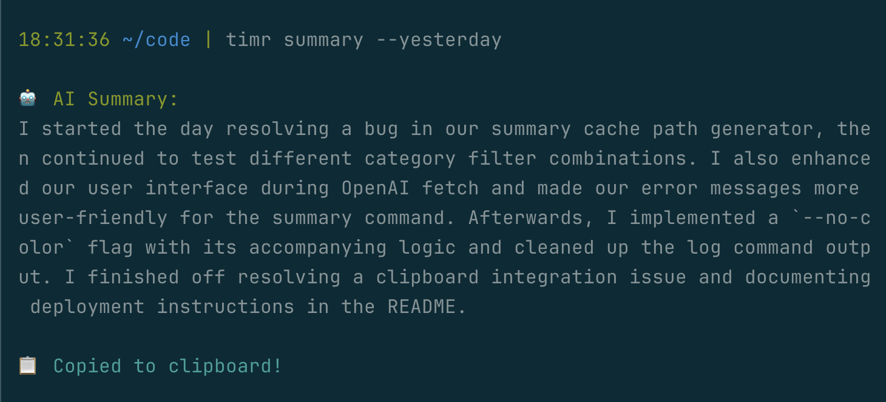

# ⏱️ timr

**`timr`** is a lightweight, terminal-based time tracker for developers.

It helps you capture what you worked on throughout the day, organize your work by category, and generate AI-powered summaries — perfect for standups or daily recaps.

---

## ✨ Features

- 🔘 Start and stop timers with required descriptions
- 🏷️ Optional category tagging (supports multiple)
- 📆 Filter logs by date, week, month, or custom range
- 🧮 Filter logs by category (OR/AND logic)
- 🎨 Clean and colorized terminal output
- 🧠 AI-generated standup summaries (via OpenAI)
  - Summarizes logs for a date range or category
  - Caches results to avoid re-querying
  - Copies the summary directly to your clipboard
- 🧪 No dependencies beyond Ruby (OpenAI optional)

---

## 📦 Installation

### 1. Clone the repo

```bash
git clone https://github.com/miguejarias/timr.git
cd timr
```

### 2. Make it executable globally

```bash
cp bin/timr /usr/local/bin/timr
```

> Now you can run `timr` from anywhere.

---

## ⚙️ Usage

### ✅ Start & stop tracking

```bash
timr start
timr stop
```

---

### 📚 View logs

```bash
timr log --week --categories=bugfix,ABCD-3987
```

#### Log Filters:

| Flag                  | Description                                |
|-----------------------|--------------------------------------------|
| `--date=YYYY-MM-DD`   | Log for a specific day                     |
| `--yesterday`         | Log for yesterday                          |
| `--week`              | Log for the current week                   |
| `--month`             | Log for the current month                  |
| `--from=...` / `--to=...` | Custom date range                     |
| `--categories=A,B`    | Filter logs by one or more categories      |
| `--match-all`         | Only show logs matching **all** categories |
| `--no-color`          | Disable terminal color output              |



---

### 🧠 Generate a standup summary (AI)

```bash
timr summary --today
```

#### Summary Options:

| Flag                  | Description                                |
|-----------------------|--------------------------------------------|
| `--date=YYYY-MM-DD`   | Summary for a specific day                 |
| `--week`              | Summary for the current week               |
| `--month`             | Summary for the current month              |
| `--from=...` / `--to=...` | Summary for a custom range            |
| `--categories=A,B`    | Only summarize matching categories         |
| `--match-all`         | Require all categories                     |
| `--refresh`           | Ignore cache and request a new summary     |

> 🧠 Summaries are:
> - Cached locally in `.timr/summaries/`
> - Copied automatically to your clipboard



---

## 🧪 Example Commands

```bash
timr start
timr stop
timr log --yesterday
timr log --week --categories=BUGFIX
timr summary --month --categories=DEVOPS
timr summary --week --refresh
timr status
```

---

## 🔐 OpenAI Integration

To use summaries, set your OpenAI API key in your environment:

```bash
export OPENAI_API_KEY=your-key-here
```

You can add it to your shell profile:

```bash
echo 'export OPENAI_API_KEY=your-key-here' >> ~/.zshrc
```

---

## Why I Built This

I'm a software engineer, and I tend to forget exactly what I worked on during the day. 
By the time morning standup arrives, I feel like I'm actively trying to remember what 
I did when it's my turn to give an updte, and I often leave things out if I don't take notes.

I built **`timr`** to help me:
- Track what I do at work
- Categorize work items for context and future queries
- Generate accurate summaries I can drop into Slack on chat standup days

This tool can of course be used for general logging/query/summaries.

---

## 📁 Data Storage

All files are stored locally under:

```bash
~/.timr/
```

Includes:
- Individual JSON log files per day
- Cached summaries in `.timr/summaries/`
- Current running timer in `current.json`

No data is shared or synced.

---

## 🧠 Summary Cache Example

```
~/.timr/
├── 2025-07-20.json
├── 2025-07-21.json
├── current.json
└── summaries/
    ├── 2025-07-20--2025-07-21--BUGFIX--DEVOPS.txt
    └── ...
```

---

## 🧼 Uninstall

If you want to remove `timr`:

```bash
rm /usr/local/bin/timr
rm -rf ~/.timr
```

---

## 📜 License

MIT

---

## 💬 Feedback

Open an issue or discussion at:  
👉 [https://github.com/miguejarias/timr](https://github.com/miguejarias/timr)
